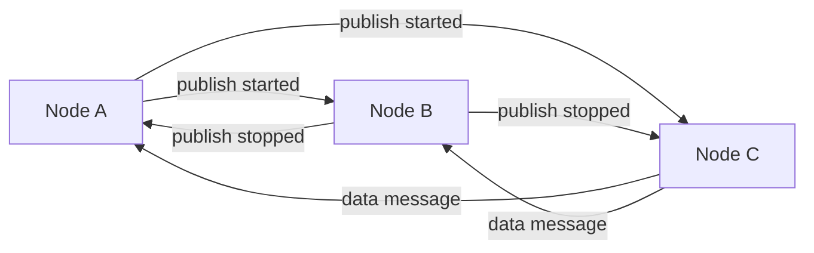

<Warning>
These endpoints are for **internal cluster communication only**. They should not be called directly by external applications.
</Warning>

## Overview

When Ant Media Server runs in cluster mode, nodes communicate with each other using internal REST APIs. These endpoints are hidden from public documentation and are automatically called by the cluster infrastructure.

**Base Path:** `/cluster-communication`

## Publish Started Notification

Notifies other cluster nodes when streaming starts on a node.

```bash POST /cluster-communication/publish-started-notification/{id}
curl -X POST "https://node2.example.com:5443/LiveApp/rest/cluster-communication/publish-started-notification/stream123?role=publisher&mainTrackId=main123" \
  -H "Authorization: Bearer {internal_token}"
```

<ParamField path="id" type="string" required>
  Stream ID that started publishing
</ParamField>

<ParamField query="role" type="string">
  Role of the stream (e.g., `publisher`, `player`)
</ParamField>

<ParamField query="mainTrackId" type="string">
  Main track ID if this is a subtrack
</ParamField>

<ResponseField name="success" type="boolean">
  Whether notification was received successfully
</ResponseField>

### When This is Called

- A stream starts publishing on Node A
- Node A notifies all other cluster nodes (B, C, D, etc.)
- Other nodes update their internal state to know where the stream is located
- Players on other nodes can be redirected to the correct origin node

## Publish Stopped Notification

Notifies other cluster nodes when streaming stops on a node.

```bash POST /cluster-communication/publish-stopped-notification/{id}
curl -X POST "https://node2.example.com:5443/LiveApp/rest/cluster-communication/publish-stopped-notification/stream123?role=publisher&mainTrackId=main123" \
  -H "Authorization: Bearer {internal_token}"
```

<ParamField path="id" type="string" required>
  Stream ID that stopped publishing
</ParamField>

<ParamField query="role" type="string">
  Role of the stream
</ParamField>

<ParamField query="mainTrackId" type="string">
  Main track ID if this is a subtrack
</ParamField>

<ResponseField name="success" type="boolean">
  Whether notification was received successfully
</ResponseField>

### When This is Called

- A stream stops publishing on Node A
- Node A notifies all other cluster nodes
- Other nodes update their state to mark the stream as inactive
- New publish attempts can create a fresh stream on any node

## Virtual Stream Data Message

Forwards data channel messages from virtual streams (conferences) between nodes.

```bash POST /cluster-communication/virtual-stream-data-message/{id}/{binary}
curl -X POST "https://node2.example.com:5443/LiveApp/rest/cluster-communication/virtual-stream-data-message/room123/false" \
  -H "Content-Type: application/octet-stream" \
  -H "Authorization: Bearer {internal_token}" \
  --data-binary @message.bin
```

<ParamField path="id" type="string" required>
  Virtual stream (conference room) ID
</ParamField>

<ParamField path="binary" type="boolean" required>
  Whether the data is binary (`true`) or text (`false`)
</ParamField>

<ParamField body="data" type="binary" required>
  Raw message data to forward
</ParamField>

<ResponseField name="success" type="boolean">
  Whether message was forwarded successfully
</ResponseField>

### When This is Called

- User on Node A sends a data channel message in a conference
- The message needs to reach participants on Node B
- Node A forwards the message to Node B via this endpoint
- Node B delivers it to local conference participants

<Note>
Virtual streams (conferences) do not have internal cluster audio/video communication - only data messages are forwarded this way.
</Note>

## Cluster Architecture

### How Cluster Communication Works



### Request Flow

1. **Event occurs** on origin node (stream start/stop, data message)
2. **Origin node sends** notification to all other cluster nodes
3. **Receiving nodes** update their internal state
4. **State synchronization** allows proper routing of play requests

### Authentication

Cluster communication uses internal JWT tokens that are:
- Generated automatically by the cluster infrastructure
- Different from public API tokens
- Not exposed to external clients
- Validated using cluster-shared secrets

## Cluster Configuration

These endpoints are automatically activated when cluster mode is enabled. Configuration is done in server settings:

```properties
# MongoDB for shared state
db.type=mongodb
db.host=mongodb.example.com

# Cluster mode
cluster.mode=true
cluster.name=ams-cluster

# Node discovery
cluster.nodes=node1.example.com,node2.example.com,node3.example.com
```

## Monitoring Cluster Communication

You can monitor cluster communication in the server logs:

```bash
# Stream started notification
INFO  [ClusterNotificationService] Received publish started notification for stream123

# Stream stopped notification
INFO  [ClusterNotificationService] Received publish stopped notification for stream123

# Data message forwarded
INFO  [ClusterNotificationService] Forwarded data message for conference room123
```

## Security Considerations

<Warning>
**Do not expose these endpoints publicly!**

These endpoints should only be accessible:
- Within the private cluster network
- Between trusted cluster nodes
- Behind firewall rules that restrict access
</Warning>

### Network Security

1. **Private network** - Cluster nodes should communicate over a private network
2. **Firewall rules** - Restrict cluster communication ports to known node IPs
3. **TLS encryption** - Use HTTPS for all cluster communication
4. **Token validation** - Ensure internal tokens are properly validated

### Best Practices

- Keep cluster communication on a separate network interface
- Monitor cluster communication logs for anomalies
- Regularly rotate cluster authentication secrets
- Use network segmentation to isolate cluster traffic

## Troubleshooting

### Common Issues

**Nodes not receiving notifications:**
- Check network connectivity between nodes
- Verify firewall rules allow cluster communication
- Ensure all nodes have correct cluster configuration
- Check MongoDB connectivity (shared state)

**Data messages not forwarded:**
- Verify conference room exists on both nodes
- Check cluster communication logs
- Ensure binary/text flag matches message type

**Authentication failures:**
- Verify cluster secret is identical on all nodes
- Check token expiration settings
- Ensure system clocks are synchronized (NTP)

### Debug Logging

Enable debug logging for cluster communication:

```xml
<!-- logback.xml -->
<logger name="io.antmedia.rest.ClusterNotificationService" level="DEBUG"/>
<logger name="io.antmedia.cluster" level="DEBUG"/>
```

This will show detailed cluster communication:
```
DEBUG [ClusterNotificationService] Sending publish started to node2.example.com
DEBUG [ClusterNotificationService] Response: {"success":true}
```
