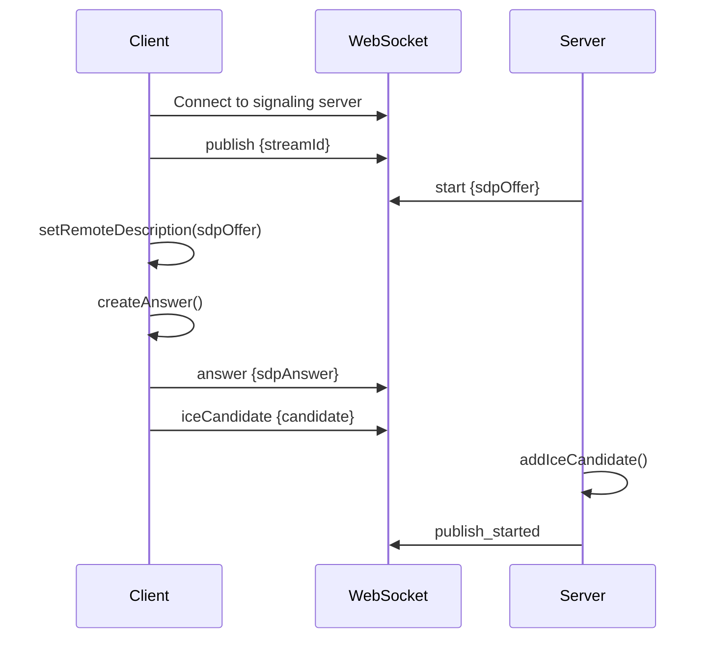
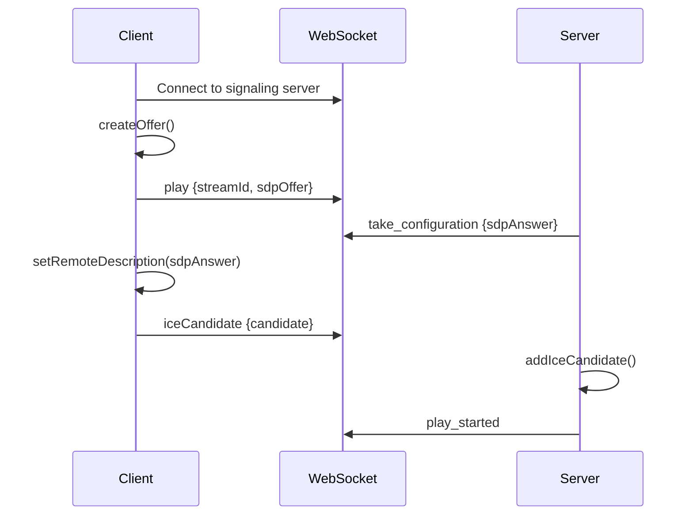
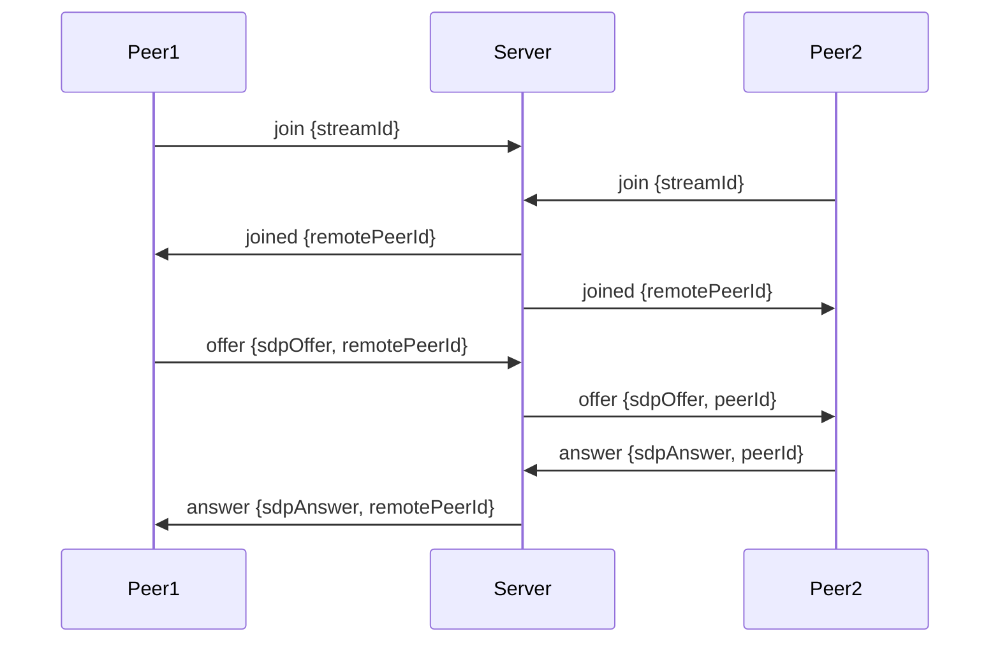

## Introduction

Ant Media Server provides a comprehensive WebRTC API that enables real-time audio and video communication in web browsers and mobile applications. The WebRTC API consists of three main components:

- **IWebRTCAdaptor** - Core WebRTC adapter interface for managing streams and clients
- **IWebRTCClient** - Interface for WebRTC client connections and media transmission
- **IWebRTCMuxer** - Interface for multiplexing streams to multiple clients

## Architecture

The WebRTC architecture in Ant Media Server follows a client-server model with the following components:

### Server-Side Components

**WebRTC Adaptor** (`IWebRTCAdaptor`)
- Manages registration and unregistration of muxers and clients
- Handles adaptive streaming quality based on network conditions
- Tracks active streams and viewer statistics
- Implements excessive bandwidth algorithms for optimal streaming

**WebRTC Muxer** (`IWebRTCMuxer`)
- Multiplexes single stream to multiple WebRTC clients
- Manages video and audio packet distribution
- Supports multiple tracks for advanced use cases
- Provides client registration and management

**WebRTC Client** (`IWebRTCClient`)
- Represents individual WebRTC peer connection
- Handles SDP offer/answer exchange
- Manages ICE candidate gathering and exchange
- Sends video and audio packets to connected peers

### Client-Side Components

On the client side, you'll use the JavaScript WebRTC SDK which communicates with the server through:

1. **WebSocket Signaling** - For exchanging SDP and ICE candidates
2. **WebRTC Peer Connection** - For actual media transmission
3. **Media Streams** - For accessing camera/microphone or receiving remote streams

## Signaling Flow

### Publishing Flow

### Playing Flow

### Peer-to-Peer Flow

## Browser Requirements

### Supported Browsers

Ant Media Server WebRTC API is compatible with all modern browsers that support WebRTC:

| Browser | Minimum Version | Notes |
|---------|----------------|-------|
| Chrome | 74+ | Full support |
| Firefox | 66+ | Full support |
| Safari | 12.1+ | Requires HTTPS |
| Edge | 79+ | Chromium-based |
| Opera | 62+ | Full support |

### Mobile Browser Support

| Platform | Browser | Minimum Version |
|----------|---------|----------------|
| iOS | Safari | 12.1+ |
| iOS | Chrome | 74+ |
| Android | Chrome | 74+ |
| Android | Firefox | 66+ |

### Required Browser APIs

The following browser APIs must be supported:

- **getUserMedia** - For accessing camera and microphone
- **RTCPeerConnection** - For establishing peer connections
- **WebSocket** - For signaling communication
- **MediaStream** - For handling media streams

### HTTPS Requirement

WebRTC requires a secure context (HTTPS) for accessing media devices in production environments. The only exception is:

- `localhost` for development purposes
- `127.0.0.1` for local testing

## Key Features

### Adaptive Bitrate Streaming

The server automatically adjusts stream quality based on network conditions:

- **Automatic Quality Selection** - Server selects optimal bitrate for each client
- **Force Stream Quality** - Override automatic selection for specific resolution
- **Multiple Resolutions** - Support for ABR with multiple quality levels

### Statistics and Monitoring

Comprehensive statistics available through the API:

- **Client Statistics** - Bitrate, packet loss, RTT measurements
- **Stream Information** - Number of viewers, active streams
- **Performance Metrics** - Frame send periods, packet counts

### Clustering Support

WebRTC API supports clustered deployments:

- Automatic stream routing between nodes
- Load balancing across cluster
- Registration to specific resolutions in cluster mode

## API Reference

See the following pages for detailed API documentation:

- [Publishing](/api/webrtc/publishing) - Learn how to publish WebRTC streams
- [Playing](/api/webrtc/playing) - Learn how to play WebRTC streams
- [Peer-to-Peer](/api/webrtc/peer-to-peer) - Learn about P2P and conference modes

## Next Steps

<CardGroup cols={2}>
  <Card title="Publishing Streams" icon="video" href="/api/webrtc/publishing">
    Learn how to publish WebRTC streams to Ant Media Server
  </Card>
  <Card title="Playing Streams" icon="play" href="/api/webrtc/playing">
    Learn how to play WebRTC streams from Ant Media Server
  </Card>
  <Card title="Peer-to-Peer" icon="users" href="/api/webrtc/peer-to-peer">
    Learn about P2P communication and conferencing
  </Card>
</CardGroup>