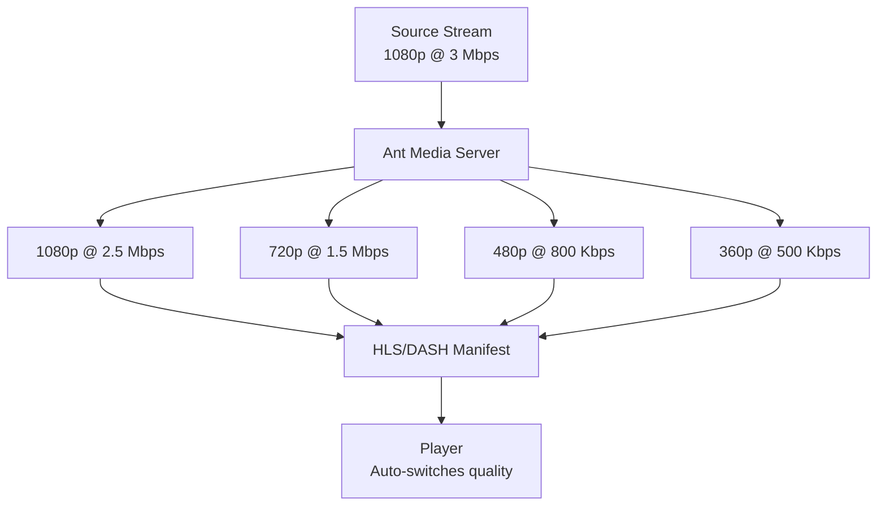

## Overview

Adaptive Bitrate (ABR) streaming dynamically adjusts video quality based on network conditions and device capabilities. Ant Media Server provides comprehensive ABR support through real-time transcoding and intelligent bitrate switching.

## How ABR Works

When ABR is enabled, Ant Media Server:

1. **Receives** the source stream at original quality
2. **Transcodes** to multiple quality levels (renditions)
3. **Packages** all renditions for delivery
4. **Adapts** playback quality based on client bandwidth



## Encoder Settings

ABR is configured through the `EncoderSettings` class, which defines each quality profile:

```java EncoderSettings.java:8-24
public class EncoderSettings implements Serializable{
    
    private  int height;
    private  int videoBitrate;
    private  int audioBitrate;
    private boolean  forceEncode = true;
    
    public static final String RESOLUTION_HEIGHT = "height";
    public static final String VIDEO_BITRATE = "videoBitrate";
    public static final String AUDIO_BITRATE = "audioBitrate";
    public static final String FORCE_ENCODE = "forceEncode";
}
```

### Key Parameters

- **height**: Resolution height in pixels (e.g., 480, 720, 1080)
- **videoBitrate**: Video bitrate in bits per second
- **audioBitrate**: Audio bitrate in bits per second
- **forceEncode**: Whether to encode even if source is lower resolution

## Configuration Examples

### Via Application Settings

Configure ABR profiles in your application settings:

```properties
encoderSettingsString=[
  {"height":1080,"videoBitrate":2500000,"audioBitrate":128000},
  {"height":720,"videoBitrate":1500000,"audioBitrate":96000},
  {"height":480,"videoBitrate":800000,"audioBitrate":64000},
  {"height":360,"videoBitrate":500000,"audioBitrate":64000}
]
```

```java AppSettings.java:865
@Value("${encoderSettingsString:${"+SETTINGS_ENCODER_SETTINGS_STRING+":}}")
private String encoderSettingsString = "";
```

<Note>
If `encoderSettingsString` is empty, Ant Media Server operates in SFU (Selective Forwarding Unit) mode for WebRTC, forwarding streams without transcoding.
</Note>

### Via REST API

Set encoder settings dynamically:

```bash
curl -X PUT "https://your-server:5443/AppName/rest/v2/broadcasts/{streamId}/encoder-settings" \
  -H "Content-Type: application/json" \
  -d '[
    {"height":720,"videoBitrate":1500000,"audioBitrate":96000},
    {"height":480,"videoBitrate":800000,"audioBitrate":64000}
  ]'
```

## Encoder Configuration

### Encoder Selection

Ant Media Server automatically selects the best encoder:

```java AppSettings.java:1377
@Value( "${encoderName:${" + SETTINGS_ENCODING_ENCODER_NAME +":}}")
private String encoderName = "";
```

**Hardware Encoders** (GPU):
- `h264_nvenc` - NVIDIA GPU
- `h264_qsv` - Intel Quick Sync
- `h264_videotoolbox` - Apple VideoToolbox
- `h264_vaapi` - Linux VA-API

**Software Encoders** (CPU):
- `libx264` - H.264 software encoder
- `libopenh264` - Cisco OpenH264
- `libvpx` - VP8/VP9 encoder

<Tip>
Leave `encoderName` empty to auto-detect. The server tries GPU encoders first, falling back to CPU encoders.
</Tip>

### Encoder Parameters

Configure encoder-specific parameters:

```java AppSettings.java:1399-1400
@Value("${encoderParameters:{}}")
private Map<String, Map<String,String>> encoderParameters = new HashMap<>();
```

Example configuration:

```json
{
  "libx264": {
    "preset": "veryfast",
    "profile": "main",
    "tune": "zerolatency"
  },
  "h264_nvenc": {
    "preset": "ll",
    "profile": "main",
    "rc": "cbr"
  },
  "libvpx": {
    "deadline": "realtime",
    "cpu-used": "5"
  }
}
```

### Encoder Settings

```properties
encoderThreadCount=0
encoderThreadType=0
gopSize=60
constantRateFactor=23
aacEncodingEnabled=true
```

#### GOP Size

```java AppSettings.java
@Value( "${gopSize:${" + SETTINGS_GOP_SIZE +":60}}")
private String gopSize = "60";
```

GOP (Group of Pictures) size affects:
- **Seeking accuracy**: Smaller GOP = more precise seeking
- **Encoding efficiency**: Larger GOP = better compression
- **Latency**: Smaller GOP = lower latency

<Warning>
For low-latency streaming, use GOP size of 2-3 seconds (60-90 frames at 30fps).
</Warning>

## Quality Profiles

### Recommended Profiles

#### Full HD Multi-bitrate

```json
[
  {"height": 1080, "videoBitrate": 4500000, "audioBitrate": 128000},
  {"height": 720, "videoBitrate": 2500000, "audioBitrate": 128000},
  {"height": 480, "videoBitrate": 1200000, "audioBitrate": 96000},
  {"height": 360, "videoBitrate": 800000, "audioBitrate": 96000},
  {"height": 240, "videoBitrate": 500000, "audioBitrate": 64000}
]
```

#### HD Mobile-Optimized

```json
[
  {"height": 720, "videoBitrate": 1500000, "audioBitrate": 96000},
  {"height": 480, "videoBitrate": 800000, "audioBitrate": 64000},
  {"height": 360, "videoBitrate": 500000, "audioBitrate": 64000}
]
```

#### Low-Bandwidth

```json
[
  {"height": 480, "videoBitrate": 600000, "audioBitrate": 64000},
  {"height": 360, "videoBitrate": 400000, "audioBitrate": 48000},
  {"height": 240, "videoBitrate": 250000, "audioBitrate": 48000}
]
```

## Advanced Features

### Force Encoding

The `forceEncode` parameter controls whether to transcode when the source resolution is lower than the target:

```java EncoderSettings.java:15-19
private boolean  forceEncode = true;
```

- **true**: Always encode to target resolution (may upscale)
- **false**: Skip encoding if source is lower resolution

### Original Stream in ABR

Include the original quality stream alongside transcoded versions:

```java AppSettings.java:1011
@Value ( "${useOriginalWebRTCEnabled:${" + SETTINGS_USE_ORIGINAL_WEBRTC_ENABLED +":false}}" )
private boolean useOriginalWebRTCEnabled=false;
```

```properties
useOriginalWebRTCEnabled=true
addOriginalMuxerIntoHlsPlaylist=true
```

### Hardware Scaling

Use GPU for scaling in addition to encoding:

```properties
hwScalingEnabled=true
```

This offloads scaling to the GPU, reducing CPU usage.

## Stats-Based ABR

Ant Media Server includes intelligent bitrate switching based on real-time statistics:

```java AppSettings.java:733-749
@Value( "${statsBasedABREnabled:${" + SETTINGS_STATS_BASED_ABR_ALGORITHM_ENABLED +":false}}")
private boolean statsBasedABRAlgorithmEnabled;

@Value( "${abrDownScalePacketLostRatio:${" + SETTINGS_ABR_DOWN_SCALE_PACKET_LOST_RATIO +":0.1}}")
private double abrDownScalePacketLostRatio = 0.1;

@Value( "${abrUpScalePacketLostRatio:${" + SETTINGS_ABR_UP_SCALE_PACKET_LOST_RATIO +":0.05}}")
private double abrUpScalePacketLostRatio = 0.05;

@Value( "${abrUpScaleRTTMs:${" + SETTINGS_ABR_UP_SCALE_RTT_MS +":50}}")
private int abrUpScaleRTTMs = 50;

@Value( "${abrUpScaleJitterMs:${" + SETTINGS_ABR_UP_SCALE_JITTER_MS +":5}}")
private int abrUpScaleJitterMs = 5;
```

### Configuration

```properties
statsBasedABREnabled=true
abrDownScalePacketLostRatio=0.1
abrUpScalePacketLostRatio=0.05
abrUpScaleRTTMs=50
abrUpScaleJitterMs=5
```

**How it works**:
- Monitor packet loss, RTT, and jitter
- Switch to lower quality when packet loss > 10%
- Switch to higher quality when packet loss < 5% and RTT < 50ms

## Performance Considerations

### CPU Usage

Each additional quality profile requires encoding resources:

- **1080p transcoding**: ~100-150% CPU per stream (software)
- **720p transcoding**: ~50-75% CPU per stream (software)
- **480p transcoding**: ~25-35% CPU per stream (software)

<Tip>
For high concurrency, use GPU encoding or limit ABR profiles to 2-3 renditions.
</Tip>

### GPU Encoding

GPU encoding provides:
- **10-20x faster** than CPU encoding
- **Lower CPU usage** for higher concurrency
- **Slightly lower quality** at same bitrate

### Encoder Selection Preference

```properties
encoderSelectionPreference=gpu_and_cpu
```

Options:
- `gpu_and_cpu`: Try GPU first, fallback to CPU
- `only_gpu`: Only use GPU (fail if unavailable)

## Monitoring ABR

Check encoding status via REST API:

```bash
curl "https://your-server:5443/AppName/rest/v2/broadcasts/{streamId}"
```

Response includes:
```json
{
  "streamId": "stream1",
  "status": "broadcasting",
  "speed": 1.0,
  "encoderBlockedStreams": [],
  "subFolder": "streams"
}
```

## Troubleshooting

### Encoding Not Starting

1. Check encoder availability:
   ```bash
   ffmpeg -encoders | grep h264
   ```

2. Verify encoder settings are valid JSON

3. Check CPU/GPU resources

### Quality Issues

1. Increase bitrate for target resolution
2. Adjust GOP size
3. Try different encoder preset
4. Enable hardware encoding

### High CPU Usage

1. Reduce number of ABR profiles
2. Enable GPU encoding
3. Increase encoder preset speed (e.g., `ultrafast`)
4. Use lower resolutions

## Next Steps

<CardGroup cols={2}>
  <Card title="Streaming Protocols" icon="tower-broadcast" href="/concepts/streaming-protocols">
    Learn about protocol options for ABR delivery
  </Card>
  <Card title="Architecture" icon="diagram-project" href="/concepts/architecture">
    Understand how ABR fits into the system
  </Card>
</CardGroup>
