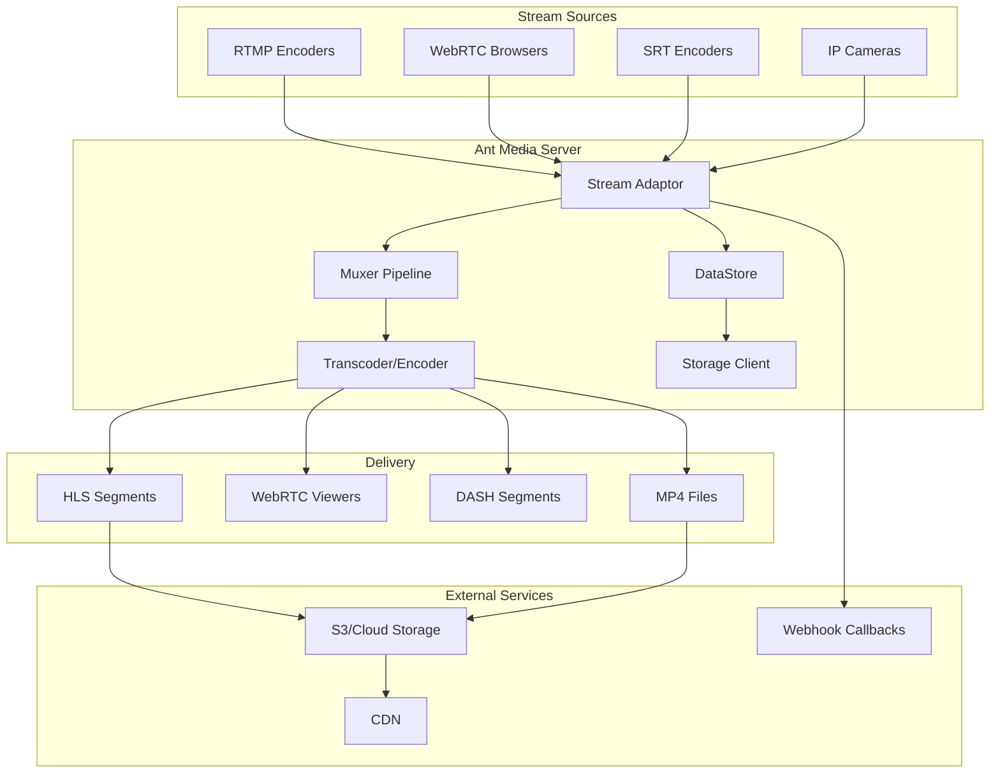
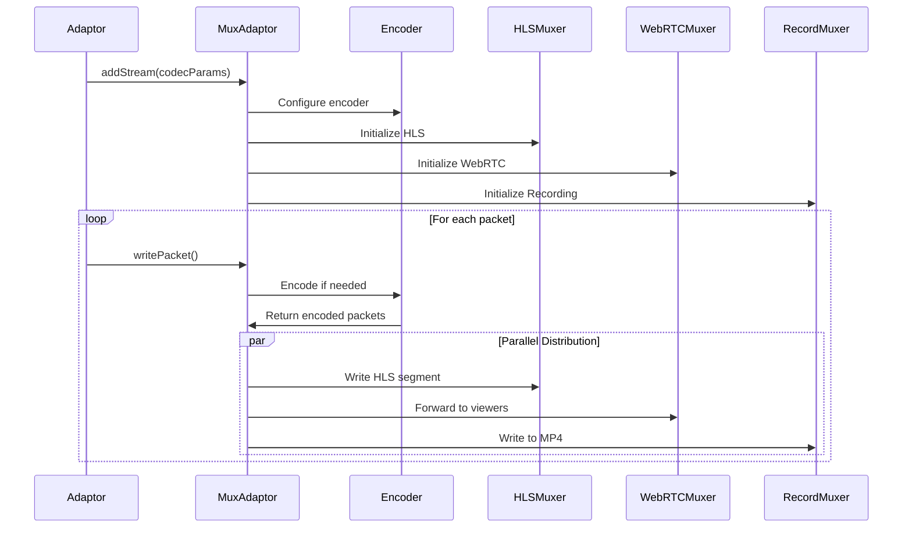
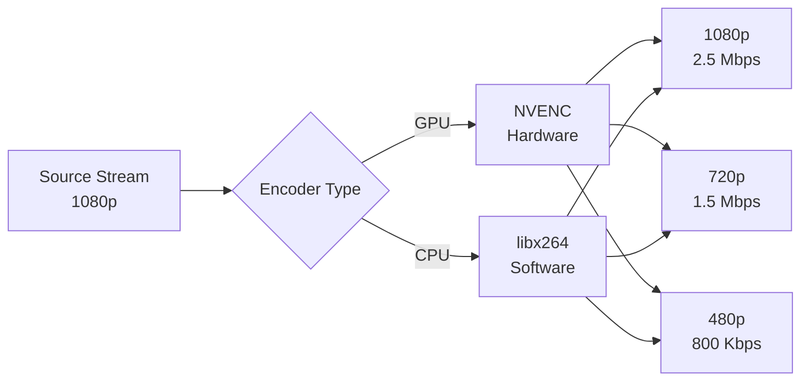
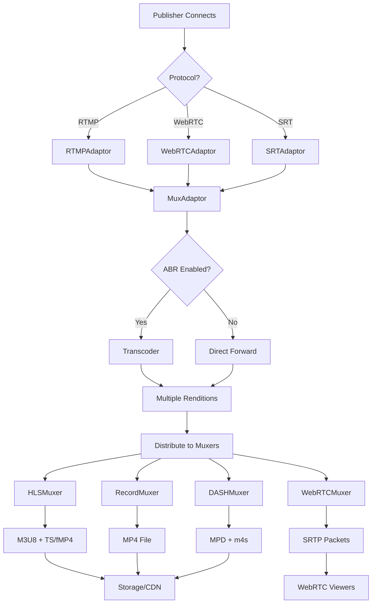
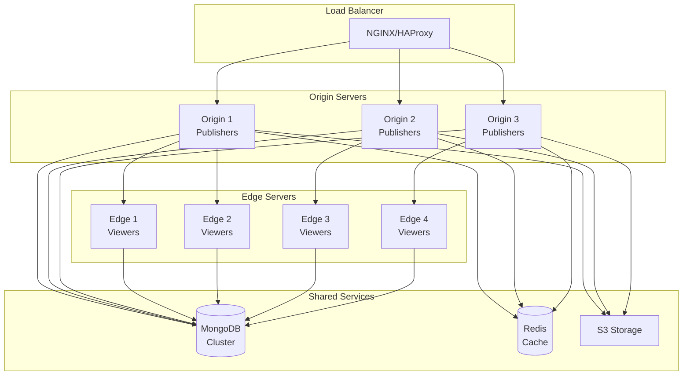

## Overview

Ant Media Server is built on a modular architecture that handles live streaming from ingestion through delivery. Understanding the core components helps you optimize performance, troubleshoot issues, and design scalable deployments.

## High-Level Architecture



## Core Components

### 1. Application Adapter

The entry point for all streaming operations:

```java AntMediaApplicationAdapter.java:117
public class AntMediaApplicationAdapter extends MultiThreadedApplicationAdapter 
    implements IAntMediaStreamHandler, IShutdownListener {
```

**Responsibilities**:
- Accept incoming connections (RTMP, WebRTC, SRT)
- Authenticate publishers and viewers
- Manage stream lifecycle
- Coordinate between components
- Handle webhook callbacks

**Key Features**:
- Multi-threaded request handling
- Stream security filters
- Cluster communication
- Analytics integration

### 2. Stream Adaptors

Adaptors convert protocol-specific streams into a common format.

#### RTMPAdaptor

Handles RTMP stream ingestion:

```java RTMPAdaptor.java
public class RTMPAdaptor extends Adaptor {
    // Processes RTMP handshake and media packets
    // Extracts audio/video streams
    // Forwards to MuxAdaptor
}
```

**Key operations**:
- RTMP handshake negotiation
- FLV tag parsing
- Audio/video stream extraction
- Metadata processing

#### SRTAdaptor

Handles SRT (Secure Reliable Transport) streams:

```java SRTAdaptor.java
public class SRTAdaptor {
    // Handles SRT protocol with ARQ
    // Provides error correction
    // Maintains stream quality over unreliable networks
}
```

**Key features**:
- Automatic Repeat Request (ARQ)
- Forward Error Correction (FEC)
- Encryption support
- Latency control

#### WebRTC Adaptor

Manages WebRTC peer connections:

```java IWebRTCAdaptor.java
public interface IWebRTCAdaptor {
    // SDP offer/answer negotiation
    // ICE candidate exchange
    // DTLS/SRTP media handling
}
```

**Components**:
- Signaling server integration
- STUN/TURN server communication
- RTP packet processing
- RTCP statistics collection

### 3. MuxAdaptor

The central media processing pipeline:

```java MuxAdaptor.java
public class MuxAdaptor {
    // Coordinates all muxers
    // Manages encoding pipeline
    // Handles stream distribution
}
```

**Responsibilities**:
- Initialize muxers for each output format
- Coordinate transcoding operations
- Distribute packets to all active muxers
- Monitor stream health
- Manage adaptive bitrate profiles

**Pipeline Flow**:



### 4. Muxers

Muxers package media for different delivery formats:

#### HLSMuxer

Creates HLS playlists and segments:

```java HLSMuxer.java:40
public class HLSMuxer extends Muxer {
```

**Key operations**:
- Generate M3U8 playlists
- Create TS or fMP4 segments
- Manage segment rotation
- Upload to S3/CDN
- Support for low-latency HLS

**Configuration** (AppSettings.java:854-897):
```java
private boolean hlsMuxingEnabled = true;
private String hlsListSize = "15";
private String hlsTime = "2";
private String hlsPlayListType = null;
private String hlsSegmentType = HLS_SEGMENT_TYPE_MPEGTS;
```

**Segment naming**:
```java HLSMuxer.java:174-206
segmentFilename = httpEndpoint + "/" + subFolder + "/" + streamName + segmentSuffix + ".ts";
```

#### Mp4Muxer

Records streams to MP4 files:

```java Mp4Muxer.java
public class Mp4Muxer extends Muxer {
    // Creates MP4 container
    // Handles moov atom positioning
    // Manages file rotation
}
```

**Features**:
- Fast-start MP4 (moov before mdat)
- Automatic file rotation
- Date/time stamped filenames
- Cloud storage upload

#### RecordMuxer

Coordinates all recording formats:

```java RecordMuxer.java
public class RecordMuxer extends Muxer {
    // Manages MP4 and WebM recording
    // Handles simultaneous recording
}
```

#### WebMMuxer

Creates WebM format recordings:

```java WebMMuxer.java
public class WebMMuxer extends Muxer {
    // VP8/VP9 video support
    // Vorbis/Opus audio support
}
```

### 5. Encoder/Transcoder

Handles video and audio transcoding for adaptive bitrate:

**Encoder Selection** (AppSettings.java:1377):
```java
private String encoderName = ""; // Auto-detect: h264_nvenc, libx264, etc.
```

**Supported encoders**:

**GPU Hardware**:
- `h264_nvenc` - NVIDIA NVENC
- `h264_qsv` - Intel Quick Sync
- `h264_vaapi` - Linux VA-API
- `h264_videotoolbox` - Apple VideoToolbox

**CPU Software**:
- `libx264` - H.264 software encoder
- `libopenh264` - Cisco OpenH264
- `libvpx` - VP8/VP9 encoder

**Encoding Pipeline**:



**EncoderSettings** (EncoderSettings.java:8-24):
```java
public class EncoderSettings {
    private int height;
    private int videoBitrate;
    private int audioBitrate;
    private boolean forceEncode = true;
}
```

### 6. DataStore

Persists stream metadata and configuration:

**Implementation**:
```java
public interface DataStore {
    // Save/retrieve broadcast info
    // Manage stream metadata
    // Store viewer statistics
    // Handle VoD records
}
```

**Supported backends**:
- **MongoDB** - Production deployments
- **MapDB** - Development/testing
- **Redis** - Cluster mode metadata

**Stored entities**:
- Broadcast information (stream ID, status, quality)
- Encoder settings
- Stream statistics
- Viewer counts
- VoD metadata
- Subscriber/token information

### 7. Storage Client

Handles cloud storage integration:

**Supported providers**:
- Amazon S3
- Azure Blob Storage
- Google Cloud Storage
- S3-compatible (MinIO, DigitalOcean Spaces)

**Operations**:
- Upload HLS segments
- Upload MP4 recordings
- Upload preview images
- Delete on completion
- Manage storage classes

**Configuration** (AppSettings.java:640-669):
```java
private boolean s3RecordingEnabled;
private String s3AccessKey;
private String s3SecretKey;
private String s3RegionName;
private String s3BucketName;
private String s3Endpoint;
```

## Streaming Pipeline

### Ingest to Delivery Flow



### Packet Flow Detail

1. **Receive** (AppSettings.java:1001-1003)
   - Protocol-specific adaptor accepts connection
   - Authenticates publisher
   - Extracts codec parameters

2. **Process** (Muxer.java:918)
   ```java
   public synchronized boolean addStream(AVCodecParameters codecParameters, 
                                         AVRational timebase, int streamIndex)
   ```
   - Initialize streams in all muxers
   - Configure bitstream filters
   - Setup time base mapping

3. **Encode** (if ABR enabled)
   - Decode source stream
   - Encode to multiple bitrates
   - Apply encoder-specific parameters

4. **Mux** (Muxer.java:1204)
   ```java
   public synchronized void writePacket(AVPacket pkt, AVRational inputTimebase, 
                                        AVRational outputTimebase, int codecType)
   ```
   - Convert timestamps
   - Apply bitstream filters
   - Write to container format

5. **Deliver**
   - HLS: Upload segments to storage
   - WebRTC: Forward via SRTP
   - Recording: Write to local/remote file

## Cluster Architecture

For high availability and scalability:



### Cluster Components

**Origin Servers**:
- Accept publisher connections
- Perform transcoding
- Generate HLS/DASH
- Upload to shared storage

**Edge Servers**:
- Serve viewers
- Pull streams from origins
- Cache segments locally
- Reduce origin load

**Cluster Communication** (AppSettings.java:753):
```java
private String clusterCommunicationKey;
```

**Shared DataStore**:
- Synchronized stream metadata
- Cluster node status
- Viewer distribution

## Performance Considerations

### Resource Usage

**Per Stream (SFU Mode - No Transcoding)**:
- CPU: 5-10%
- RAM: 50-100 MB
- Bandwidth: Source bitrate × viewer count

**Per Stream (MCU Mode - With Transcoding)**:
- CPU: 50-150% (software) or 10-20% (hardware)
- RAM: 200-500 MB
- Bandwidth: Sum of all rendition bitrates × viewer count

### Optimization Strategies

**1. Use Hardware Encoding**
```properties
encoderName=h264_nvenc
encoderSelectionPreference=gpu_and_cpu
```

**2. Limit ABR Profiles**
```json
encoderSettingsString=[
  {"height":720,"videoBitrate":1500000,"audioBitrate":96000},
  {"height":480,"videoBitrate":800000,"audioBitrate":64000}
]
```

**3. Enable SFU for WebRTC**
```properties
encoderSettingsString=
```
(Empty = SFU mode)

**4. Optimize HLS Segments**
```properties
hlsTime=2
hlsListSize=5
deleteHLSFilesOnEnded=true
```

**5. Use Cluster Mode**
```properties
clusterCommunicationKey=secretKey
```

## Monitoring & Debugging

### Key Metrics

**Server Level**:
- CPU and RAM usage
- Network throughput
- Active stream count
- Encoder queue depth

**Stream Level**:
- Bitrate (video/audio)
- Frame rate
- Packet loss
- Viewer count
- Encoding speed

### REST API Monitoring

```bash
# Get server stats
curl https://your-server:5443/AppName/rest/v2/server-info

# Get broadcast info
curl https://your-server:5443/AppName/rest/v2/broadcasts/{streamId}

# Get viewer stats
curl https://your-server:5443/AppName/rest/v2/broadcasts/{streamId}/stats
```

### Logging

Component-specific logging:

```properties
log4j.logger.io.antmedia.muxer=DEBUG
log4j.logger.io.antmedia.webrtc=DEBUG
log4j.logger.io.antmedia.enterprise=INFO
```

## Security Architecture

### Stream Security

**Token-based Authentication** (AppSettings.java:1083-1093):
```java
private boolean publishTokenControlEnabled;
private boolean playTokenControlEnabled;
```

**JWT Authentication**:
```java
private boolean publishJwtControlEnabled;
private boolean playJwtControlEnabled;
private String jwtSecretKey;
```

**IP Filtering**:
```java
private String allowedPublisherCIDR;
private String remoteAllowedCIDR;
```

### Transport Security

- **WebRTC**: DTLS/SRTP encryption (built-in)
- **HTTPS**: SSL/TLS for HLS/DASH delivery
- **RTMPS**: TLS encryption for RTMP
- **SRT**: Built-in AES encryption

## Next Steps

<CardGroup cols={2}>
  <Card title="Streaming Protocols" icon="tower-broadcast" href="/concepts/streaming-protocols">
    Explore supported protocols in detail
  </Card>
  <Card title="Adaptive Bitrate" icon="signal" href="/concepts/adaptive-bitrate">
    Configure ABR transcoding
  </Card>
  <Card title="Ultra-Low Latency" icon="bolt" href="/concepts/ultra-low-latency">
    Implement WebRTC streaming
  </Card>
  <Card title="API Reference" icon="code" href="/api-reference">
    View REST API documentation
  </Card>
</CardGroup>
