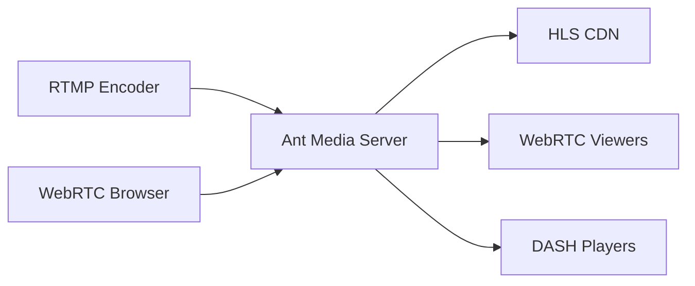

## Overview

Ant Media Server supports multiple streaming protocols for both ingesting (publishing) and delivering (playing) live streams. Understanding when to use each protocol is crucial for optimizing your streaming infrastructure.

## Ingest Protocols

Ingest protocols are used to publish streams to Ant Media Server.

### WebRTC (Web Real-Time Communication)

**Best for**: Ultra-low latency streaming from browsers and mobile apps

- **Latency**: ~0.5 seconds
- **Use cases**: Live auctions, video conferencing, interactive streaming
- **Codecs**: H.264, H.265 (HEVC), VP8, VP9
- **Transport**: UDP with SRTP encryption

<Info>
WebRTC is enabled by default. Set `webRTCEnabled=true` in your application settings.
</Info>

```java AppSettings.java:1001
@Value ( "${webRTCEnabled:${"+SETTINGS_WEBRTC_ENABLED+":true}}" )
private boolean webRTCEnabled=true;
```

#### WebRTC Configuration

Key settings for WebRTC ingest:

```properties
webRTCEnabled=true
webRTCFrameRate=30
webRTCPortRangeMin=50000
webRTCPortRangeMax=60000
stunServerURI=stun:stun1.l.google.com:19302
```

### RTMP (Real-Time Messaging Protocol)

**Best for**: Broadcasting software and hardware encoders

- **Latency**: 3-5 seconds
- **Use cases**: OBS Studio, hardware encoders, legacy systems
- **Codecs**: H.264 video, AAC audio
- **Port**: 1935 (default)

RTMP remains the most widely compatible protocol for professional broadcasting software. Ant Media Server processes RTMP streams through the `RTMPAdaptor`:

```java RTMPAdaptor.java
public class RTMPAdaptor extends Adaptor {
    // Handles RTMP stream ingestion and conversion
}
```

#### RTMP Configuration

```properties
rtmpIngestBufferTimeMs=0
rtmpMaxAnalyzeDurationMS=500
```

<Warning>
RTMP is being deprecated by major platforms. Consider migrating to SRT or WebRTC for new implementations.
</Warning>

### SRT (Secure Reliable Transport)

**Best for**: Low-latency contribution over unpredictable networks

- **Latency**: 1-3 seconds (configurable)
- **Use cases**: Remote production, contribution feeds, replacing RTMP
- **Features**: Built-in encryption, error correction, firewall traversal
- **Port**: Configurable (default varies)

SRT provides superior resilience over unreliable networks through its ARQ (Automatic Repeat Request) mechanism.

```java SRTAdaptor.java
public class SRTAdaptor {
    // Handles SRT stream ingestion with error correction
}
```

### RTSP (Real-Time Streaming Protocol)

**Best for**: IP cameras and surveillance systems

- **Latency**: 1-3 seconds
- **Use cases**: IP cameras, security systems, CCTV
- **Codecs**: H.264, H.265, AAC
- **Transport**: RTP/RTCP over TCP or UDP

Ant Media Server can pull RTSP streams from IP cameras and re-stream them:

```properties
rtspPullTransportType=tcp
rtspTimeoutDurationMs=5000
```

## Delivery Protocols

Delivery protocols are used by viewers to watch streams.

### WebRTC Playback

**Best for**: Ultra-low latency playback in browsers

- **Latency**: ~0.5 seconds
- **Use cases**: Interactive applications requiring real-time feedback
- **Platform support**: Modern browsers, mobile apps

```properties
webRTCViewerLimit=-1
playWebRTCStreamOnceForEachSession=false
```

### HLS (HTTP Live Streaming)

**Best for**: Maximum compatibility and scalability

- **Latency**: 6-30 seconds (standard), 2-6 seconds (LL-HLS)
- **Use cases**: Large audiences, VOD, mobile devices
- **Codecs**: H.264, H.265, AAC, AC3
- **Format**: MPEG-TS or fMP4 segments

HLS is the most widely supported adaptive streaming format:

```java AppSettings.java:854
@Value("${hlsMuxingEnabled:${"+SETTINGS_HLS_MUXING_ENABLED+":true}}")
private boolean hlsMuxingEnabled = true;
```

#### HLS Configuration

```properties
hlsMuxingEnabled=true
hlsListSize=15
hlsTime=2
hlsPlayListType=event
hlsSegmentType=mpegts
hlsflags=delete_segments+program_date_time
```

<Tip>
Use `hlsSegmentType=fmp4` for HEVC/H.265 streams, as MPEG-TS segments may not play correctly with HEVC.
</Tip>

#### Low-Latency HLS (LL-HLS)

For reduced latency with HLS:

```properties
hlsEnableLowLatency=true
dashEnableLowLatency=true
hlsEnabledViaDash=true
```

### DASH (Dynamic Adaptive Streaming over HTTP)

**Best for**: Standards-based adaptive streaming

- **Latency**: 6-30 seconds (standard), 3-6 seconds (LL-DASH)
- **Use cases**: OTT platforms, cross-platform delivery
- **Format**: ISO BMFF (fMP4)

```properties
dashSegDuration=6
dashFragmentDuration=0.5
dashTargetLatency=3.5
dashWindowSize=5
```

### CMAF (Common Media Application Format)

Ant Media Server supports CMAF through its DASH implementation, allowing single-file packaging for both HLS and DASH:

```properties
hlsSegmentType=fmp4
dashEnableLowLatency=true
hlsEnabledViaDash=true
```

## Protocol Comparison

| Protocol | Latency | Scalability | Compatibility | Use Case |
|----------|---------|-------------|---------------|----------|
| WebRTC | ~0.5s | Medium | Modern browsers | Real-time interaction |
| RTMP | 3-5s | High | Encoders | Broadcasting software |
| SRT | 1-3s | High | Professional tools | Contribution feeds |
| RTSP | 1-3s | Low | IP cameras | Surveillance |
| HLS | 6-30s | Very High | Universal | Large audiences |
| LL-HLS | 2-6s | High | Modern clients | Low-latency at scale |
| DASH | 6-30s | Very High | Standards-based | OTT platforms |

## Choosing the Right Protocol

### For Ingestion

1. **Real-time interaction needed**: WebRTC
2. **Professional broadcasting**: RTMP or SRT
3. **Unreliable networks**: SRT
4. **IP cameras**: RTSP pull
5. **Browser-based publishing**: WebRTC

### For Delivery

1. **Ultra-low latency required**: WebRTC
2. **Maximum compatibility**: HLS
3. **Large-scale delivery**: HLS or DASH with CDN
4. **Low latency at scale**: LL-HLS or LL-DASH
5. **Standards compliance**: DASH

## Multi-Protocol Workflow

Ant Media Server excels at protocol translation. A typical workflow:



The server automatically transcodes and packages streams for all enabled delivery formats:

```java Muxer.java:918
public synchronized boolean addStream(AVCodecParameters codecParameters, AVRational timebase, int streamIndex) 
{
    // Handles stream from any ingest protocol to all muxers
}
```

## Next Steps

<CardGroup cols={2}>
  <Card title="Adaptive Bitrate" icon="signal" href="/concepts/adaptive-bitrate">
    Learn how ABR streaming optimizes delivery
  </Card>
  <Card title="Ultra-Low Latency" icon="bolt" href="/concepts/ultra-low-latency">
    Understand sub-second streaming with WebRTC
  </Card>
</CardGroup>
