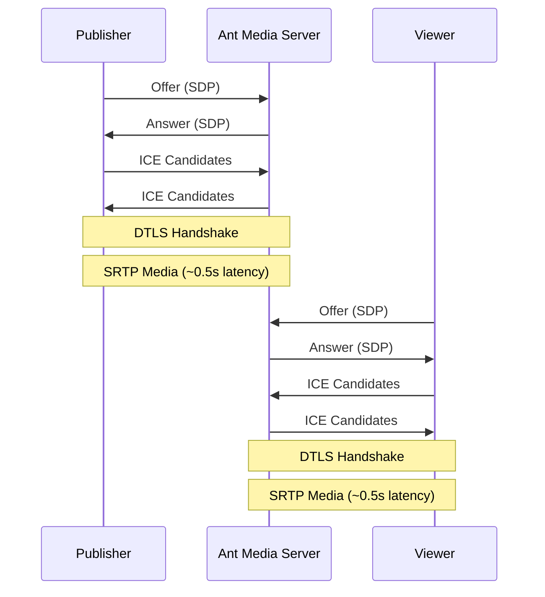
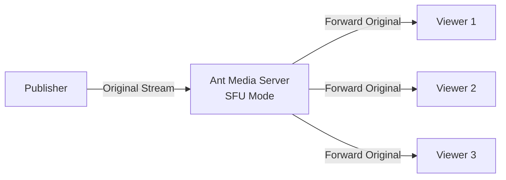
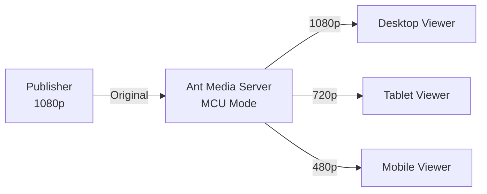

## Overview

Ultra-low latency streaming delivers live video with less than 1 second of delay, enabling truly interactive experiences. Ant Media Server achieves this through WebRTC technology, providing approximately 0.5 seconds of glass-to-glass latency.

## What is Ultra-Low Latency?

**Latency Comparison**:

| Protocol | Typical Latency | Use Case |
|----------|----------------|----------|
| WebRTC | **0.5s** | Real-time interaction |
| LL-HLS | 2-6s | Low-latency at scale |
| LL-DASH | 3-6s | Standards-based low latency |
| HLS | 6-30s | Large-scale distribution |
| RTMP | 3-5s | Legacy broadcasting |

## WebRTC Architecture

### How WebRTC Achieves Low Latency

WebRTC eliminates traditional buffering through:

1. **UDP Transport**: No TCP retransmission delays
2. **Minimal Buffering**: Jitter buffer of ~50-200ms
3. **Direct Peer Connection**: No intermediate servers (in P2P mode)
4. **Native Browser Support**: No plugin overhead



### WebRTC Components in Ant Media Server

The server implements WebRTC through several key interfaces:

```java IWebRTCAdaptor.java
public interface IWebRTCAdaptor {
    // Core WebRTC streaming interface
    // Handles peer connections, SDP negotiation, ICE
}
```

```java IWebRTCClient.java
public interface IWebRTCClient {
    // WebRTC client operations
    // Manages individual peer connections
}
```

```java IWebRTCMuxer.java
public interface IWebRTCMuxer {
    // WebRTC muxing operations
    // Handles media packaging for WebRTC delivery
}
```

## Configuration

### Basic WebRTC Settings

```java AppSettings.java:1001-1002
@Value ( "${webRTCEnabled:${" + SETTINGS_WEBRTC_ENABLED +":true}}" )
private boolean webRTCEnabled=true;
```

```properties
webRTCEnabled=true
webRTCFrameRate=30
webRTCKeyframeTime=2000
```

### Port Configuration

WebRTC requires a range of UDP ports for media:

```java AppSettings.java:1307-1315
@Value( "${webRTCPortRangeMin:${" + SETTINGS_WEBRTC_PORT_RANGE_MIN +":50000}}")
private int webRTCPortRangeMin = 50000;

@Value( "${webRTCPortRangeMax:${" + SETTINGS_WEBRTC_PORT_RANGE_MAX +":60000}}")
private int webRTCPortRangeMax = 60000;
```

```properties
webRTCPortRangeMin=50000
webRTCPortRangeMax=60000
```

<Warning>
Ensure UDP ports 50000-60000 are open in your firewall for WebRTC to function properly.
</Warning>

### ICE Configuration

ICE (Interactive Connectivity Establishment) handles NAT traversal:

```java AppSettings.java:1325-1340
@Value( "${stunServerURI:${" + SETTINGS_WEBRTC_STUN_SERVER_URI +":stun:stun1.l.google.com:19302}}")
private String stunServerURI = "stun:stun1.l.google.com:19302";

@Value( "${turnServerUsername:${" + SETTINGS_WEBRTC_TURN_SERVER_USERNAME +":}}")
private String turnServerUsername = "";

@Value( "${turnServerCredential:${" + SETTINGS_WEBRTC_TURN_SERVER_CREDENTIAL +":}}")
private String turnServerCredential = "";
```

#### STUN Configuration

```properties
stunServerURI=stun:stun1.l.google.com:19302
```

STUN servers help discover public IP addresses for NAT traversal.

#### TURN Configuration

For restrictive networks, configure TURN relay:

```properties
stunServerURI=turn:turn.example.com:3478
turnServerUsername=myuser
turnServerCredential=mypassword
```

### TCP Candidates

Enable TCP fallback for restrictive firewalls:

```java AppSettings.java:1350
@Value( "${webRTCTcpCandidatesEnabled:${" + SETTINGS_WEBRTC_TCP_CANDIDATE_ENABLED +":false}}")
private boolean webRTCTcpCandidatesEnabled;
```

```properties
webRTCTcpCandidatesEnabled=true
```

<Note>
TCP candidates increase latency slightly but improve connectivity in restricted networks.
</Note>

### SDP Semantics

```java AppSettings.java:1357-1358
@Value( "${webRTCSdpSemantics:${" + SETTINGS_WEBRTC_SDP_SEMANTICS +":" + SDP_SEMANTICS_UNIFIED_PLAN + "}}")
private String webRTCSdpSemantics = SDP_SEMANTICS_UNIFIED_PLAN;
```

```properties
webRTCSdpSemantics=unifiedPlan
```

Options:
- `unifiedPlan`: Modern standard (recommended)
- `planB`: Legacy format (deprecated)

## Scaling WebRTC

### Viewer Limits

Control concurrent WebRTC viewers per stream:

```properties
webRTCViewerLimit=-1
```

- `-1`: Unlimited viewers
- `>0`: Maximum concurrent WebRTC viewers per stream

### SFU Mode vs. Transcoding

#### SFU (Selective Forwarding Unit)

**When**: No `encoderSettingsString` configured



**Benefits**:
- Zero transcoding overhead
- Maximum server capacity
- Minimal latency
- CPU efficient

**Limitations**:
- All viewers get same quality
- No adaptive bitrate
- Requires capable viewers

#### MCU (Multipoint Control Unit) with Transcoding

**When**: `encoderSettingsString` is configured



**Benefits**:
- Adaptive bitrate for viewers
- Optimized for each device
- Better viewer experience

**Limitations**:
- Higher CPU usage
- Slight latency increase (~100-200ms)
- Resource intensive

### Cluster Deployment

For high-scale WebRTC:

```properties
clusterCommunicationKey=yourSecretKey
```

Ant Media Server automatically:
- Distributes load across nodes
- Routes viewers to optimal servers
- Handles failover

## Performance Optimization

### Codec Selection

Supported video codecs:

```java AppSettings.java:440-448
@Value( "${h264Enabled:${" + SETTINGS_H264_ENABLED +":true}}")
private boolean h264Enabled = true;

@Value( "${vp8Enabled:${" + SETTINGS_VP8_ENABLED +":true}}")
private boolean vp8Enabled = true;

@Value( "${h265Enabled:${" + SETTINGS_H265_ENABLED +":true}}")
private boolean h265Enabled = true;
```

```properties
h264Enabled=true
vp8Enabled=true
h265Enabled=false
```

**Recommendations**:
- **H.264**: Best compatibility, good quality
- **VP8**: Open-source, Chrome-optimized
- **H.265**: Better compression, limited support

### Frame Rate Control

```java AppSettings.java:1299-1300
@Value( "${webRTCFrameRate:${" + SETTINGS_WEBRTC_FRAME_RATE +":30}}" )
private int webRTCFrameRate = 30;
```

```properties
webRTCFrameRate=30
```

Lower frame rates reduce bandwidth:
- **30 fps**: Standard quality
- **15 fps**: Low bandwidth
- **60 fps**: High motion content

### Resolution & Bitrate Limits

```properties
maxResolutionAccept=1080
maxBitrateAccept=3000000
maxFpsAccept=30
```

Prevent resource abuse by limiting incoming streams.

## Technical Deep Dive

### Media Pipeline

WebRTC media flows through the muxer system:

```java Muxer.java:840-865
public synchronized boolean addVideoStream(int width, int height, AVRational timebase, int codecId, int streamIndex,
        boolean isAVC, AVCodecParameters codecpar) {
    boolean result = false;
    AVFormatContext outputContext = getOutputFormatContext();
    if (outputContext != null && isCodecSupported(codecId) && !isRunning.get())
    {
        registeredStreamIndexList.add(streamIndex);
        AVStream outStream = avformat_new_stream(outputContext, null);
        outStream.codecpar().width(width);
        outStream.codecpar().height(height);
        outStream.codecpar().codec_id(codecId);
        outStream.codecpar().codec_type(AVMEDIA_TYPE_VIDEO);
        // ... configuration continues
    }
}
```

### Packet Processing

Minimal buffering for low latency:

```java Muxer.java:1204-1221
public synchronized void writePacket(AVPacket pkt, AVRational inputTimebase, AVRational outputTimebase, int codecType)
{
    AVFormatContext context = getOutputFormatContext();
    
    long pts = pkt.pts();
    long dts = pkt.dts();
    
    pkt.duration(av_rescale_q(pkt.duration(), inputTimebase, outputTimebase));
    pkt.pos(-1);
    
    totalSizeInBytes += pkt.size();
    
    currentTimeInSeconds = av_rescale_q(pkt.dts(), inputTimebase, avRationalTimeBase);
    // ... process and write packet
}
```

## Use Cases

### Live Auctions

**Requirements**:
- Sub-second latency
- Synchronized bidding
- Mobile support

**Configuration**:
```properties
webRTCEnabled=true
webRTCFrameRate=30
statsBasedABREnabled=true
```

### Video Conferencing

**Requirements**:
- Bidirectional communication
- Multiple participants
- Screen sharing

**Configuration**:
```properties
webRTCEnabled=true
dataChannelEnabled=true
maxVideoTrackCount=9
maxAudioTrackCount=9
```

### Interactive Gaming

**Requirements**:
- Minimal latency
- High frame rate
- Low jitter

**Configuration**:
```properties
webRTCEnabled=true
webRTCFrameRate=60
abrUpScaleJitterMs=2
```

### Surveillance

**Requirements**:
- Real-time monitoring
- Multiple cameras
- Recording

**Configuration**:
```properties
webRTCEnabled=true
mp4MuxingEnabled=true
hlsMuxingEnabled=true
```

## Trade-offs: WebRTC vs. HLS

### When to Use WebRTC

**Advantages**:
- Ultra-low latency (~0.5s)
- Real-time interaction
- Built-in encryption (DTLS/SRTP)
- NAT traversal built-in

**Limitations**:
- Higher server resources per viewer
- Complex firewall configuration
- Limited CDN support
- Browser compatibility variations

### When to Use HLS

**Advantages**:
- Unlimited scalability via CDN
- Universal device support
- Lower server resources
- Simple infrastructure

**Limitations**:
- Higher latency (6-30s)
- Not suitable for interaction
- Adaptive bitrate complexity

### Hybrid Approach

Ant Media Server can deliver both simultaneously:

```properties
webRTCEnabled=true
hlsMuxingEnabled=true
```

**Use case**: Interactive studio with mass audience
- Studio participants use WebRTC
- Mass audience uses HLS via CDN

## Monitoring & Troubleshooting

### WebRTC Statistics

Monitor real-time statistics:

```bash
curl "https://your-server:5443/AppName/rest/v2/broadcasts/{streamId}/webrtc/stats"
```

Response includes:
```json
{
  "videoPacketsLost": 0,
  "audioPacketsLost": 0,
  "videoFramesDecoded": 1234,
  "audioLevel": 0.5,
  "videoRoundTripTime": 0.02,
  "videoJitter": 0.001
}
```

### Common Issues

#### High Packet Loss

**Symptoms**: Choppy video, audio dropouts

**Solutions**:
1. Enable stats-based ABR
2. Reduce bitrate
3. Check network quality
4. Configure TURN server

#### Connection Failures

**Symptoms**: Unable to establish connection

**Solutions**:
1. Verify STUN/TURN configuration
2. Check firewall UDP ports
3. Enable TCP candidates
4. Test with different networks

#### High Latency

**Symptoms**: >2 seconds delay

**Solutions**:
1. Disable transcoding (use SFU mode)
2. Reduce jitter buffer
3. Check server resources
4. Optimize network routing

## Next Steps

<CardGroup cols={2}>
  <Card title="Streaming Protocols" icon="tower-broadcast" href="/concepts/streaming-protocols">
    Compare WebRTC with other protocols
  </Card>
  <Card title="Architecture" icon="diagram-project" href="/concepts/architecture">
    Understand WebRTC in the system architecture
  </Card>
</CardGroup>
