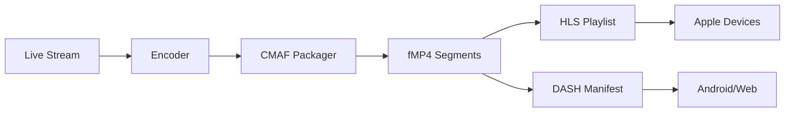

## Overview

CMAF (Common Media Application Format) is a standardized media format that enables efficient delivery of streaming content. It uses fragmented MP4 (fMP4) containers that can be packaged for both HLS and DASH, reducing storage and encoding costs.

### Key Benefits

- **Unified workflow**: Single encode for HLS and DASH
- **Reduced storage**: One set of media files for multiple protocols
- **Lower latency**: Smaller chunks enable faster delivery
- **Better codec support**: Native support for HEVC, AV1, VP9
- **Efficient**: Reduced CDN costs and bandwidth usage
- **Standards-based**: ISO BMFF/MP4 format

## How CMAF Works

CMAF uses fragmented MP4 (fMP4) containers that can be delivered via:
- **HLS with fMP4**: Apple devices, browsers
- **DASH**: Android, browsers, smart TVs
- **MSE (Media Source Extensions)**: Modern browsers



## Enabling CMAF in Ant Media Server

### Configuration

CMAF is enabled through HLS with fMP4 segments:

```properties
# Enable HLS with CMAF/fMP4
settings.hlsMuxingEnabled=true
settings.hlsSegmentType=fmp4

# Enable DASH (uses same CMAF segments)
settings.dashMuxingEnabled=true

# Segment duration (shorter for low latency)
settings.hlsTime=2
settings.dashSegDuration=2s

# Fragment duration (sub-segment chunks)
settings.dashFragmentDuration=0.5s
```

### Publishing for CMAF

<CodeGroup>

```bash RTMP to CMAF
# Publish via RTMP
ffmpeg -re -i input.mp4 \
  -c:v libx264 -preset veryfast -b:v 2500k \
  -c:a aac -b:a 128k \
  -f flv rtmp://your-server.com/WebRTCAppEE/stream123

# Access as:
# HLS: https://your-server.com:5443/WebRTCAppEE/streams/stream123.m3u8
# DASH: https://your-server.com:5443/WebRTCAppEE/streams/stream123.mpd
```

```javascript WebRTC to CMAF
const webRTCAdaptor = new WebRTCAdaptor({
    websocket_url: "wss://your-server.com:5443/WebRTCAppEE/websocket",
    mediaConstraints: { video: true, audio: true },
    callback: (info) => {
        if (info === "initialized") {
            webRTCAdaptor.publish("stream123");
        }
    }
});

// CMAF available as both HLS and DASH
```

```bash Direct CMAF Creation
# Create CMAF with FFmpeg
ffmpeg -i input.mp4 \
  -c:v libx264 -b:v 2500k -g 48 -keyint_min 48 -sc_threshold 0 \
  -c:a aac -b:a 128k \
  -f dash \
  -seg_duration 2 \
  -frag_duration 0.5 \
  -streaming 1 \
  -use_template 1 \
  -use_timeline 1 \
  -adaptation_sets "id=0,streams=v id=1,streams=a" \
  output.mpd
```

```bash CMAF with Multiple Bitrates
ffmpeg -re -i input.mp4 \
  -map 0:v -map 0:a -map 0:v -map 0:a -map 0:v -map 0:a \
  -c:v:0 libx264 -b:v:0 800k -s:v:0 640x360 \
  -c:v:1 libx264 -b:v:1 1400k -s:v:1 960x540 \
  -c:v:2 libx264 -b:v:2 2800k -s:v:2 1280x720 \
  -c:a aac -b:a 128k \
  -f dash \
  -seg_duration 2 \
  -use_template 1 \
  -use_timeline 1 \
  -adaptation_sets "id=0,streams=0,1,2 id=1,streams=3,4,5" \
  output.mpd
```

</CodeGroup>

## Playing CMAF Streams

### HLS with fMP4 (CMAF)

<CodeGroup>

```html HLS.js Player
<script src="https://cdn.jsdelivr.net/npm/hls.js@latest"></script>
<video id="video" controls width="100%"></video>

<script>
  const video = document.getElementById('video');
  const hlsUrl = 'https://your-server.com:5443/WebRTCAppEE/streams/stream123.m3u8';
  
  if (Hls.isSupported()) {
    const hls = new Hls({
      enableWorker: true,
      lowLatencyMode: true,
      backBufferLength: 90
    });
    
    hls.loadSource(hlsUrl);
    hls.attachMedia(video);
    
    hls.on(Hls.Events.MANIFEST_PARSED, () => {
      video.play();
    });
  }
</script>
```

```swift iOS (AVPlayer)
import AVKit
import AVFoundation

let player = AVPlayer(
    url: URL(string: "https://your-server.com:5443/WebRTCAppEE/streams/stream123.m3u8")!
)
let playerViewController = AVPlayerViewController()
playerViewController.player = player

// Present player
present(playerViewController, animated: true) {
    player.play()
}
```

</CodeGroup>

### DASH (CMAF)

<CodeGroup>

```html dash.js Player
<script src="https://cdn.dashjs.org/latest/dash.all.min.js"></script>
<video id="video" controls width="100%"></video>

<script>
  const url = 'https://your-server.com:5443/WebRTCAppEE/streams/stream123.mpd';
  const player = dashjs.MediaPlayer().create();
  
  player.initialize(document.getElementById('video'), url, true);
  
  player.updateSettings({
    streaming: {
      lowLatencyEnabled: true,
      liveDelay: 3,
      delay: {
        liveDelay: 3
      },
      buffer: {
        fastSwitchEnabled: true
      }
    }
  });
</script>
```

```html Shaka Player
<script src="https://cdnjs.cloudflare.com/ajax/libs/shaka-player/4.3.5/shaka-player.compiled.js"></script>
<video id="video" controls width="100%"></video>

<script>
  const video = document.getElementById('video');
  const player = new shaka.Player(video);
  
  player.configure({
    streaming: {
      rebufferingGoal: 2,
      bufferingGoal: 10,
      lowLatencyMode: true
    }
  });
  
  player.load('https://your-server.com:5443/WebRTCAppEE/streams/stream123.mpd')
    .then(() => {
      console.log('Stream loaded');
    })
    .catch((error) => {
      console.error('Error loading stream:', error);
    });
</script>
```

```java Android (ExoPlayer)
import com.google.android.exoplayer2.ExoPlayer
import com.google.android.exoplayer2.MediaItem
import com.google.android.exoplayer2.source.dash.DashMediaSource
import com.google.android.exoplayer2.upstream.DefaultHttpDataSource

val player = ExoPlayer.Builder(context).build()
val dataSourceFactory = DefaultHttpDataSource.Factory()

val dashUrl = "https://your-server.com:5443/WebRTCAppEE/streams/stream123.mpd"
val mediaItem = MediaItem.fromUri(dashUrl)

val dashMediaSource = DashMediaSource.Factory(dataSourceFactory)
    .createMediaSource(mediaItem)

player.setMediaSource(dashMediaSource)
player.prepare()
player.play()
```

```python Python (mpd_parser)
import requests
from mpd_parser import MPDParser

# Parse DASH manifest
mpd_url = "https://your-server.com:5443/WebRTCAppEE/streams/stream123.mpd"
response = requests.get(mpd_url)

parser = MPDParser(response.text)
for period in parser.periods:
    for adaptation_set in period.adaptation_sets:
        for representation in adaptation_set.representations:
            print(f"Quality: {representation.bandwidth}bps")
            print(f"Segments: {representation.segment_template}")
```

</CodeGroup>

## Low Latency CMAF (LL-DASH / LL-HLS)

### Configuration for Ultra-Low Latency

```properties
# Enable low latency modes
settings.lLDashEnabled=true
settings.lLHLSEnabled=true

# Short segments
settings.hlsTime=2
settings.dashSegDuration=2s

# Small fragments (chunks)
settings.dashFragmentDuration=0.2s
settings.hlsPartTargetDuration=0.2

# Target latency
settings.targetLatency=3s

# Streaming mode
settings.dashHttpStreaming=true
```

### LL-DASH Player Configuration

```javascript
const player = dashjs.MediaPlayer().create();

player.updateSettings({
    streaming: {
        lowLatencyEnabled: true,
        liveDelay: 3,  // Target 3 second latency
        liveCatchup: {
            enabled: true,
            mode: 'liveCatchupModeDefault'
        },
        delay: {
            liveDelay: 3,
            liveDelayFragmentCount: NaN,  // Use time-based delay
            useSuggestedPresentationDelay: false
        },
        buffer: {
            fastSwitchEnabled: true,
            flushBufferAtTrackSwitch: false,
            reuseExistingSourceBuffers: true,
            bufferTimeDefault: 12,
            bufferTimeAtTopQuality: 12,
            bufferTimeAtTopQualityLongForm: 12
        }
    }
});
```

## CMAF Structure

### File Organization

```bash
streams/
├── stream123.m3u8              # HLS master playlist
├── stream123.mpd               # DASH manifest
├── stream123_init.mp4          # Initialization segment
├── stream123_000000000.m4s     # Media segment 0
├── stream123_000000001.m4s     # Media segment 1
├── stream123_000000002.m4s     # Media segment 2
└── ...

# With ABR:
streams/
├── stream123.m3u8              # HLS master
├── stream123.mpd               # DASH master
├── stream123_360p/
│   ├── init.mp4
│   └── segment_*.m4s
├── stream123_720p/
│   ├── init.mp4
│   └── segment_*.m4s
└── stream123_1080p/
    ├── init.mp4
    └── segment_*.m4s
```

### HLS Playlist (CMAF)

```m3u8
#EXTM3U
#EXT-X-VERSION:7
#EXT-X-TARGETDURATION:2
#EXT-X-SERVER-CONTROL:CAN-BLOCK-RELOAD=YES,PART-HOLD-BACK=0.6
#EXT-X-PART-INF:PART-TARGET=0.2
#EXT-X-MEDIA-SEQUENCE:0
#EXT-X-MAP:URI="stream123_init.mp4"
#EXT-X-PROGRAM-DATE-TIME:2024-01-15T10:30:00.000Z
#EXTINF:2.000,
stream123_000000000.m4s
#EXTINF:2.000,
stream123_000000001.m4s
#EXTINF:2.000,
stream123_000000002.m4s
```

### DASH Manifest (CMAF)

```xml
<?xml version="1.0" encoding="UTF-8"?>
<MPD xmlns="urn:mpeg:dash:schema:mpd:2011" 
     type="dynamic"
     minimumUpdatePeriod="PT2S"
     suggestedPresentationDelay="PT3S"
     availabilityStartTime="2024-01-15T10:30:00Z"
     publishTime="2024-01-15T10:30:00Z"
     timeShiftBufferDepth="PT30S">
  <Period start="PT0S">
    <!-- Video Adaptation Set -->
    <AdaptationSet mimeType="video/mp4" 
                   codecs="avc1.64001f" 
                   startWithSAP="1" 
                   segmentAlignment="true">
      <SegmentTemplate timescale="1000" 
                       media="stream123_$Number$.m4s" 
                       initialization="stream123_init.mp4" 
                       duration="2000" 
                       startNumber="0" />
      <Representation id="720p" 
                      bandwidth="2500000" 
                      width="1280" 
                      height="720" />
    </AdaptationSet>
    
    <!-- Audio Adaptation Set -->
    <AdaptationSet mimeType="audio/mp4" 
                   codecs="mp4a.40.2" 
                   startWithSAP="1">
      <SegmentTemplate timescale="1000" 
                       media="stream123_audio_$Number$.m4s" 
                       initialization="stream123_audio_init.mp4" 
                       duration="2000" 
                       startNumber="0" />
      <Representation id="audio" 
                      bandwidth="128000" 
                      audioSamplingRate="44100" />
    </AdaptationSet>
  </Period>
</MPD>
```

## Advanced Features

### HEVC/H.265 Support

CMAF has excellent HEVC support:

```bash
# Encode with HEVC
ffmpeg -i input.mp4 \
  -c:v libx265 -preset fast -b:v 2000k \
  -c:a aac -b:a 128k \
  -f dash \
  -seg_duration 2 \
  output.mpd
```

```properties
# Enable HEVC in Ant Media Server
settings.h265Enabled=true
settings.hlsSegmentType=fmp4
```

### Common Encryption (CENC)

CMAF supports DRM:

```bash
# Package with Widevine and PlayReady
packager \
  'in=input.mp4,stream=video,output=video.mp4' \
  'in=input.mp4,stream=audio,output=audio.mp4' \
  --enable_widevine_encryption \
  --key_server_url "https://license.server/proxy" \
  --content_id "content123" \
  --signer "widevine_test" \
  --enable_playready_encryption \
  --mpd_output output.mpd \
  --hls_master_playlist_output output.m3u8
```

## Troubleshooting

### Playback Issues

**Initialization Segment Missing:**

```bash
# Check for init.mp4
ls -la /usr/local/antmedia/webapps/WebRTCAppEE/streams/*init*

# Verify init segment in playlist
curl https://your-server.com:5443/WebRTCAppEE/streams/stream123.m3u8 | grep -i init
```

**Codec Compatibility:**

```bash
# Check codec in manifest
ffprobe https://your-server.com:5443/WebRTCAppEE/streams/stream123.mpd

# Verify browser support
# In browser console:
MediaSource.isTypeSupported('video/mp4; codecs="avc1.64001f"')
MediaSource.isTypeSupported('video/mp4; codecs="hev1.1.6.L120.90"')
```

**Segment Timing Issues:**

```bash
# Validate segment durations
ffprobe -show_entries packet=pts_time,dts_time \
  https://your-server.com:5443/WebRTCAppEE/streams/stream123_000000000.m4s
```

### Performance Optimization

```properties
# Optimize for low latency
settings.dashFragmentDuration=0.2s
settings.dashSegDuration=2s
settings.targetLatency=3s

# Optimize for quality
settings.dashFragmentDuration=2s
settings.dashSegDuration=10s
settings.useTimelineDashMuxing=true
```

## Best Practices

### Production Recommendations

1. **Use fMP4**: Set `hlsSegmentType=fmp4` for CMAF benefits
2. **Consistent GOP**: Set fixed keyframe interval (e.g., 2 seconds)
3. **Short fragments**: Use 0.2-0.5s fragments for low latency
4. **CDN optimization**: Enable CORS, set appropriate cache headers
5. **Monitor segment generation**: Track timing and availability
6. **Test across devices**: Verify HLS and DASH playback

### Quality Settings

<CodeGroup>

```properties Low Latency
settings.hlsSegmentType=fmp4
settings.dashSegDuration=1s
settings.dashFragmentDuration=0.2s
settings.lLDashEnabled=true
settings.targetLatency=2s
```

```properties High Quality VOD
settings.hlsSegmentType=fmp4
settings.dashSegDuration=10s
settings.dashFragmentDuration=2s
settings.useTimelineDashMuxing=true
```

```properties Balanced Live
settings.hlsSegmentType=fmp4
settings.dashSegDuration=4s
settings.dashFragmentDuration=1s
settings.targetLatency=6s
```

</CodeGroup>

## CMAF vs Traditional Formats

| Feature | CMAF | HLS (TS) | DASH (TS) |
|---------|------|----------|------------|
| Container | fMP4 | MPEG-TS | MPEG-TS or fMP4 |
| Storage | Single | Separate | Separate |
| HEVC Support | Excellent | Limited | Good |
| Latency | Low | Medium | Medium |
| Browser Support | Good | Excellent | Good |
| Unification | Yes | No | No |

## Migration Guide

### From Traditional HLS to CMAF

```properties
# Before (HLS with TS)
settings.hlsSegmentType=mpegts

# After (CMAF)
settings.hlsSegmentType=fmp4
settings.dashMuxingEnabled=true
```

Benefits:
- 30-40% storage reduction
- Better HEVC support
- Unified HLS/DASH workflow

## Resources

- [CMAF Specification](https://www.iso.org/standard/71975.html)
- [Apple HLS Authoring](https://developer.apple.com/documentation/http_live_streaming)
- [DASH Industry Forum](https://dashif.org/)
- Ant Media Server Enterprise Edition for LL-CMAF support